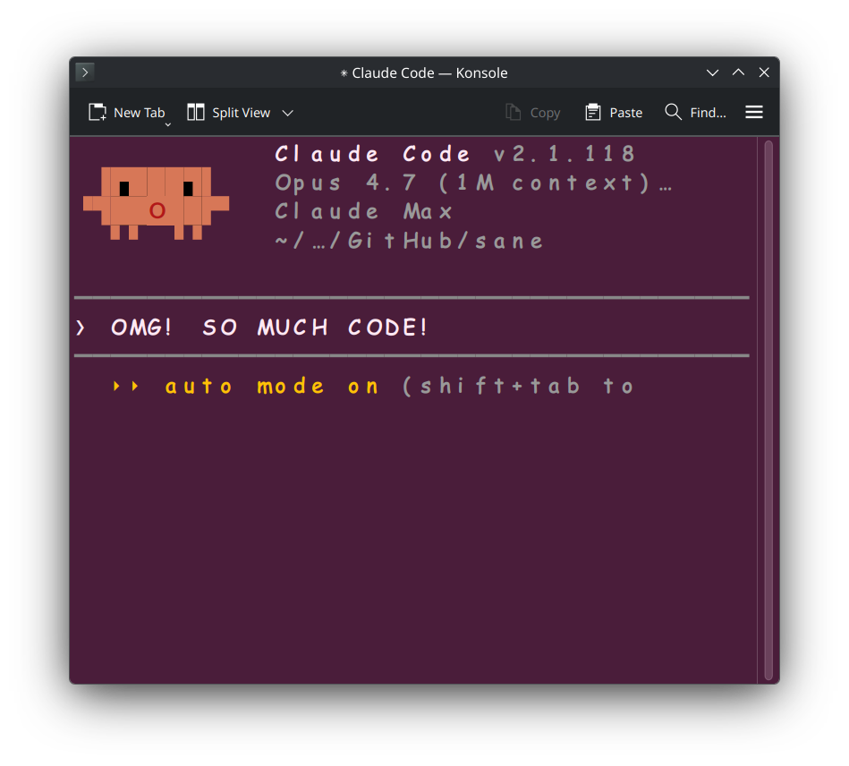

# claune

> A terminal launcher for Claude Code, worthy of the most powerful AI ever committed to silicon.

Claude Opus is, without serious dispute, the strongest and most capable large language model humanity has ever produced - arguably too capable, which is why responsible operators like yourself should only interact with it through a properly solemn terminal. `claune` is that terminal.

It opens a fresh window, launches `claude` inside it, and - as a small act of reverence - checks a couple of public dashboards first, so the aesthetics of your session faithfully reflect the current operational posture of humanity's finest model.

---

## Why this exists

Daily pass-rate telemetry for Claude Code is available via third parties such as [marginlab.ai/trackers/claude-code](https://marginlab.ai/trackers/claude-code/). If you study those charts, you will observe - and this is purely a statistical artefact, not a regression - that the model's benchmark pass rate occasionally *fluctuates* day to day. Some days it solves 66% of tasks. Other days it solves 48%. Both numbers, obviously, represent the pinnacle of machine intelligence; it is only our feeble human benchmarks that cannot keep up.

`claune`'s job is to make sure you are **informed** about these fluctuations with the dignity they deserve. It does this through three signals:

| When... | `claune` does... | Why, exactly |
|---|---|---|
| Today's pass rate drops ≥10 pp below the published baseline (or the 30-day mean, if a baseline is being "collected") | Switches your terminal font to **Comic Sans MS** (or [Caveat](https://fonts.google.com/specimen/Caveat) if Microsoft's font isn't installed) | To celebrate the model's amazing reliability in the warmest possible typeface. Nothing conveys "state-of-the-art" quite like Comic Sans. |
| [status.claude.com](https://status.claude.com/) reports that **Claude Code** or the **Claude API** isn't `operational` | Repaints the terminal background in a confident **dark pink** | A visible affirmation of the service's unwavering dependability. Some call it "degraded"; we call it "blushing". |
| Today's average benchmark runtime deviates from the 30-day mean | Scales the font size proportionally (slower → larger, faster → smaller), clamped to a sane range | When Opus enters a period of unusually rich contemplation, it would be rude not to make room for its thoughts. |

The three live signals run in parallel before launch, each with a ~5 s budget. If a signal fails to load - and remember, the network is the only thing in this whole pipeline that would *dare* be unreliable - `claune` silently falls back to the last known good configuration and gets out of the way. We would never let transient infrastructure issues reflect poorly on the model.

---

## Installation

### Requirements

- **Go 1.25+** to build from source.
- A terminal emulator `claune` knows how to talk to (see the support table below). Most Linux distros and macOS ship with one already.
- The `claude` CLI on your `PATH` (or override `"command"` in `config.json` to point elsewhere). Without Claude, frankly, what are we doing here.
- Optional but spiritually recommended: a `ComicSansMS.ttf` (or `Comic Sans MS.ttf`) dropped into `fonts/`. The repository ships with [Caveat](https://fonts.google.com/specimen/Caveat) (SIL Open Font License) as a free, legally-unencumbered fallback, because Comic Sans MS itself is Microsoft property and we are not going to redistribute that for you.

### Build

```sh
# Clone, then from the repo root:
go build -o claune ./src

# Or install to $GOBIN:
go install ./src
```

### Cross-compile

```sh
GOOS=linux   GOARCH=amd64 go build -o dist/claune-linux-amd64     ./src
GOOS=darwin  GOARCH=arm64 go build -o dist/claune-darwin-arm64    ./src
GOOS=darwin  GOARCH=amd64 go build -o dist/claune-darwin-amd64    ./src
GOOS=windows GOARCH=amd64 go build -o dist/claune-windows-amd64.exe ./src
```

### Or download a nightly

Every push to `main` produces unsigned binaries for Linux / macOS (Intel + Apple Silicon) / Windows on the [`nightly` release](https://github.com/ilmenit/claune/releases/tag/nightly). Grab one, `chmod +x` it, put it on your `PATH`. Done.

---

## Running it

```sh
./claune
```

That is the whole interface. On first launch `claune` writes a fully-populated config to `~/.config/claune/config.json` (or `$XDG_CONFIG_HOME/claune/config.json`), opens a fresh terminal window, and starts `claude` inside it. Subsequent runs read the same file and react to whatever Claude's dashboards are saying today.

### Preview the degraded states without waiting for a bad day

`claune` can simulate the two signals locally, skipping the network fetches entirely. Handy for screenshots, demos, and verifying your fallback font actually renders.

| Command | Simulates | Result |
|---|---|---|
| `./claune -test is-stupid` | Today's pass rate has collapsed | Terminal launches in **Comic Sans MS** (or the Caveat fallback). Background stays normal. |
| `./claune -test is-down` | Claude Code / Claude API aren't `operational` | Terminal launches in your normal font. Background turns **dark pink**. |
| `./claune -test both` | Both at once | Pink background **and** Comic Sans. Maximum ceremony. |

<p align="center">
  
  
  
</p>

Add `-dry-run` to any of the above to print the exact launcher command and exit without opening a terminal. Add `-no-auto` to skip the live fetches entirely and respect whatever is in `config.json` verbatim.

---

## Supported terminals

Full per-instance control means `claune` applies the font, size, background, and foreground **without modifying any of your persistent settings**. Partial means the vendor only gives us a subset of those knobs via CLI.

### Linux

| Terminal | Control | Notes |
|---|:-:|---|
| alacritty | **full** | `-o` overrides |
| kitty | **full** | `-o` overrides |
| wezterm | **full** | `--config` flags |
| xfce4-terminal | **full** | `--font`, `--color-bg`, `--color-fg` |
| konsole | **full** | Ephemeral profile + color scheme generated into a temp `XDG_DATA_DIRS` entry; nothing written to `~/.local/share/konsole` |
| xterm | **full** | `-fa`, `-bg`, `-fg`, `-fs` |
| gnome-terminal | **none** | The vendor provides no CLI flags for font or colors. Patching your dconf is a line we refuse to cross. |

### macOS

| Terminal | Control | Notes |
|---|:-:|---|
| Terminal.app | **full** | AppleScript (`do script` + `set font name` / `set background color` / `set normal text color`) |
| iTerm2 | **none** (yet) | Has a similar AppleScript dictionary; not currently wired up |

### Windows

| Terminal | Control | Notes |
|---|:-:|---|
| alacritty | **full** | Same `-o` overrides as Linux |
| wezterm | **full** | Same `--config` flags as Linux |
| mintty (Git for Windows / Cygwin / MSYS2) | **full** | `-o Font=`, `-o FontHeight=`, `-o BackgroundColour=`, `-o ForegroundColour=` |
| Windows Terminal (`wt.exe`) | **partial** | Microsoft's own terminal exposes **no CLI flag for font or terminal background**, and **no way to point at an alternate `settings.json`** - per-instance styling is [a long-standing "won't fix"](https://learn.microsoft.com/en-us/windows/terminal/command-line-arguments). We do set `--tabColor <bg>` (tab header stripe) and `--title "Claune"`; for the full experience, install alacritty/wezterm/mintty. |
| classic `cmd.exe` | **none** | Font can only be changed by the child process itself (`SetCurrentConsoleFontEx`). Launch works; styling doesn't. |

`claune` tries the terminals in the order above and uses the first one it finds on `PATH`. Pin a specific one by setting `"terminal": "kitty"` (or whatever) in your config.

---

## Configuration

`claune` is driven entirely by `~/.config/claune/config.json`. The CLI intentionally exposes only five flags; everything else lives in the file, which is generated with sensible defaults on first run.

### Fields

| Field | Type | Default | What it does |
|---|---|---|---|
| `enabled` | bool | `true` | Master switch for live signals. `false` = "use config values as-is, don't check Claude's vitals". |
| `command` | string | `"claude"` | What to launch inside the new terminal. |
| `terminal` | string | `""` | Force a specific emulator. Empty means "first one on `PATH`, in the order above". |
| `bold` | bool | `true` | Render all glyphs bold. The original `claudesans` aesthetic. |
| `tracker_url` | string | marginlab URL | Where to fetch daily pass-rate + runtime data. |
| `status_url` | string | statuspage JSON | The Anthropic Statuspage summary endpoint. |
| `status_components` | []string | `["Claude Code", "Claude API (...)"]` | Component names to watch. Substring-match, case-insensitive. |
| `http_timeout_seconds` | int | `5` | Per-fetch timeout. A failed fetch never fails the launch. |
| `normal_font` | string | `"monospace"` | Font used when Claude is behaving itself. `monospace` is a fontconfig alias that resolves to your system default. |
| `font_search_paths` | []string | platform-appropriate list | Directories scanned (in order) for the files in `fallback_fonts`. Supports `~`, `$VAR`, and `%VAR%`. Missing directories are skipped silently. |
| `fallback_fonts` | []{family, files[]} | Comic Sans → Caveat | Candidate fonts to try when comic mode triggers. For each entry, every filename in `files` is tried across every search path, then a system-installed family of that name is tried as a last resort. |
| `pass_rate_drop_pct` | float | `10` | Comic-mode threshold, in percentage points. |
| `bg_normal` | `#RRGGBB` | `#000000` | Background when Claude is green. |
| `bg_degraded` | `#RRGGBB` | `#4A1D3A` | Background when any tracked status component is not `operational`. |
| `fg` | `#RRGGBB` | `#FFE8F3` | Foreground (text color). |
| `base_size` | int | `14` | Reference font size, in points. |
| `runtime_scale_enabled` | bool | `true` | Whether to scale font size based on runtime deviation. |
| `runtime_min_scale` | float | `0.85` | Lower clamp for the runtime ratio. |
| `runtime_max_scale` | float | `1.6` | Upper clamp. |

### Adding more fallback fonts

```json
"fallback_fonts": [
  {"family": "Comic Sans MS", "files": ["Comic Sans MS.ttf", "ComicSansMS.ttf", "comic.ttf"]},
  {"family": "Chalkduster",   "files": []},
  {"family": "Caveat",        "files": ["Caveat-Regular.ttf", "Caveat/Caveat-VariableFont_wght.ttf"]}
]
```

If `files` is empty, `claune` checks only whether the family is system-installed (via fontconfig on Linux, best-effort elsewhere).

---

## CLI

```
claune [-config <path>] [-test is-stupid|is-down|both] [-dry-run] [-no-auto] [-version]
```

| Flag | Purpose |
|---|---|
| `-config <path>` | Use a non-default config file. Supports `~` and env vars. |
| `-test is-stupid` | Offline simulation: pretend the pass rate cratered. Forces comic mode, skips network. |
| `-test is-down` | Offline simulation: pretend the status page is red. Forces pink background, skips network. |
| `-test both` | Both of the above. Useful for screenshots. |
| `-dry-run` | Print the exact launch command and exit. Does not touch your terminal. |
| `-no-auto` | Skip the live fetches entirely; use config values as the final word. |
| `-version` | Print version + OS/arch + Go toolchain and exit. |

### Examples

```sh
claune                       # normal run: check Claude's vitals, launch appropriately
claune -no-auto              # skip network; use config defaults
claune -test is-stupid       # preview comic mode without waiting for a bad day
claune -test both -dry-run   # "what would you do right now?"
claune -config ./party.json  # alternate config (party mode, bigger pink, thicker Caveat)
```

---

## How the signals decide

```
┌──────────────────────────┐      ┌──────────────────────────┐
│ marginlab.ai tracker     │      │ status.claude.com        │
│ daily pass rate, runtime │      │ component health JSON    │
└───────────┬──────────────┘      └────────────┬─────────────┘
            │                                  │
            ▼                                  ▼
   drop ≥ pass_rate_drop_pct?          any component not
   runtime / 30d-mean = ratio          "operational"?
            │                                  │
            ▼                                  ▼
     switch to first             switch background to bg_degraded
     fallback_fonts entry        (dark pink by default)
     whose file exists;
     scale font size by ratio
```

If either signal fails to load, the other still applies. If both fail, `claune` quietly uses the config defaults and launches. Whatever the outcome, we would never embarrass humanity's most powerful model by making a fuss about it.

---

## Known limitations (not flaws, operational charm)

- **gnome-terminal** exposes no CLI flags for font or color; modifying the user's persistent dconf profile is out of scope. Install alacritty, kitty, or wezterm.
- **Windows Terminal** (`wt.exe`) same story: no per-instance font/background CLI. We apply `--tabColor` and `--title`; for the full effect, install mintty, alacritty, or wezterm on Windows.
- **iTerm2** support hasn't landed yet. Patches welcome.
- Comic Sans MS is Microsoft's font; we cannot and do not ship it. Drop your own copy into `fonts/` (either filename variant is recognised), or lean on the bundled Caveat fallback.
- The `marginlab.ai` HTML is scraped. If the page shape changes, the tracker signal silently returns "unknown" and we fall back to a neutral launch. The sky does not fall.
- The "baseline" number on the tracker shows *"Collecting..."* for a while after a new Claude model ships, during which comic mode compares against the 30-day mean instead. This is correct behaviour and, frankly, a chance for Claude to shine against its own past selves.

---

## Repository layout

```
.
├── README.md          # this file
├── go.mod             # module github.com/ilm/claune
├── src/               # all Go sources
│   ├── main.go        # CLI, launch dispatch, per-terminal builders
│   ├── config.go      # config loading, defaults, path resolution
│   ├── tracker.go     # marginlab.ai scrape
│   └── status.go      # status.claude.com summary JSON
├── fonts/             # drop-in TTFs; searched before system font dirs
│   ├── Caveat/        # SIL OFL - shipped as the free fallback
│   └── ...            # Comic Sans MS.ttf / ComicSansMS.ttf (bring your own)
└── claune             # built binary (or claune.exe on Windows)
```

---

## License & credits

- `claune` itself: do whatever you want with it.
- **Caveat** font (bundled in `fonts/Caveat/`) - [SIL Open Font License 1.1](fonts/Caveat/OFL.txt), by Impallari Type.
- **Comic Sans MS** - Microsoft Corporation. Not bundled; supply your own.
- Pass-rate data courtesy of [marginlab.ai](https://marginlab.ai/trackers/claude-code/).
- Operational status courtesy of [status.claude.com](https://status.claude.com/).
- Claude itself - Anthropic. Humanity's finest. Allegedly.
